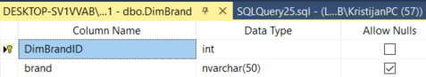
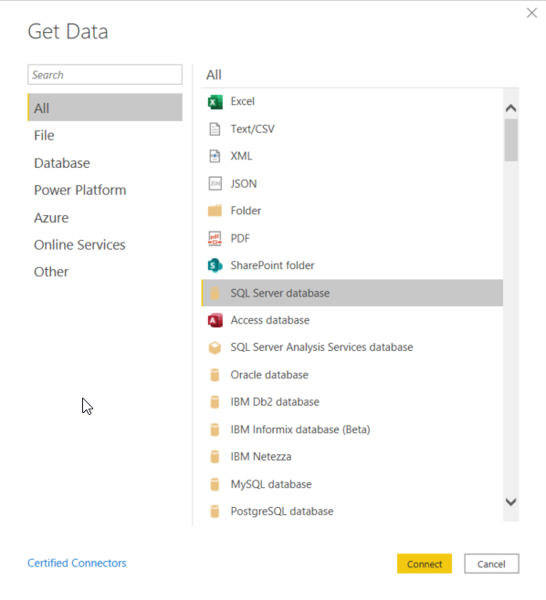

# Skladista-podataka-i-poslovna-inteligencija
Projekt iz predmeta Skladišta podataka i poslovna inteligencija (Data Warehouses and Business Intelligence)

<!-- PROJECT SHIELDS -->

<!--

*** I'm using markdown "reference style" links for readability.

*** Reference links are enclosed in brackets [ ] instead of parentheses ( ).

*** See the bottom of this document for the declaration of the reference variables
*** for contributors-url, forks-url, etc. This is an optional, concise syntax you may use.
*** https://www.markdownguide.org/basic-syntax/#reference-style-links

-->

 <!-- [![Contributors][contributors-shield]][contributors-url]

  
[![Forks][forks-shield]][forks-url]

  
[![Stargazers][stars-shield]][stars-url]

  
[![Issues][issues-shield]][issues-url]

  
[![MIT License][license-shield]][license-url]

  
[![LinkedIn][linkedin-shield]][linkedin-url]

  

<!-- PROJECT LOGO -->
 

 

  

  

<a href="https://github.com/kmaodus/moviesMERN">

  

<!--  -->

  

</a>

  <h3 align="center">College project (SPPI) - FOI 2020</h3>

Project for 'Data Warehouses and Business Intelligence' course at Faculty of Organization and Informatics
 

<!-- TABLE OF CONTENTS -->

## Table of Contents
- [About the Project](#about-the-project)
- [Built With](#built-with)
- [Some images](#some-images)
- [Bibliography](#bibliography)
- [License](#license)
- [Contact](#contact)
  

  

<!-- ABOUT THE PROJECT -->

  

## About The Project
Documentation in croatian: [SPPI_Projekt_Kristijan_Maoduš.pdf](./SPPI_Projekt_Kristijan_Maoduš.pdf)
 
### Built With

- [Microsoft SQL Server]()

  

- [Microsoft Power BI]()

  

- [Microsoft Excel]()

    
<!-- GETTING STARTED -->
  
  
Dataset: _https://www.kaggle.com/orgesleka/used-cars-database_
 
## Some images

Data Warehouse Model  
 

Original CSV file  

Cleaned CSV file Model  

Importing flat file in MSSQL  

Table design  
  

Loaded table  

Update queries  

Dimension Table Gearbox  

Dimension Table FuelType  

Dimension Table Brand  

Dimension Table Model  

Dimension Table Date  

Dimension Table Advertisement  

Fact Table Cars  

Star schema  

Power BI Import  

Power BI Connecting to SQL Server database  

Power BI Star schema  

Power BI First Report  

Power BI Second Report  

Power BI Third Report  

<!-- ROADMAP -->

## Bibliography
[1]  „Data Visualization | Microsoft Power BI“. [Online]. Available at: https://powerbi.microsoft.com/en-us/. [Accessed: 04-06-2020].

[2]  „What is Power BI? - Power BI | Microsoft Docs“. [Online]. Available at: https://docs.microsoft.com/en-us/power-bi/fundamentals/power-bi-overview. [Accessed: 04-06-2020].

[3]  O. Leka, „orgesleka/used-cars-scrapy-script: https://www.kaggle.com/orgesleka/used-cars-database“. [Online]. Available at: https://github.com/orgesleka/used-cars-scrapy-script. [Accessed: 05-06-2020].

[4]  „Understand star schema and the importance for Power BI - Power BI | Microsoft Docs“. [Online]. Available at: https://docs.microsoft.com/en-us/power-bi/guidance/star-schema. [Accessed: 05-06-2020].
<!-- CONTRIBUTING -->

  <!-- LICENSE -->

## License

  

  

Distributed under the Creative Commons Zero v1.0 Universal License.

  

  

<!-- CONTACT -->

  

  

## Contact

  
LinkedIn: [Kristijan Maoduš](https://www.linkedin.com/in/kristijan-maodus/)

  

  

<!-- ACKNOWLEDGEMENTS -->
<!-- MARKDOWN LINKS & IMAGES -->
<!-- https://www.markdownguide.org/basic-syntax/#reference-style-links -->
[contributors-shield]: https://img.shields.io/github/contributors/othneildrew/Best-README-Template.svg?style=flat-square
[contributors-url]: https://github.com/othneildrew/Best-README-Template/graphs/contributors
[forks-shield]: https://img.shields.io/github/forks/othneildrew/Best-README-Template.svg?style=flat-square
[forks-url]: https://github.com/othneildrew/Best-README-Template/network/members
[stars-shield]: https://img.shields.io/github/stars/othneildrew/Best-README-Template.svg?style=flat-square
[stars-url]: https://github.com/othneildrew/Best-README-Template/stargazers
[issues-shield]: https://img.shields.io/github/issues/othneildrew/Best-README-Template.svg?style=flat-square
[issues-url]: https://github.com/othneildrew/Best-README-Template/issues
[license-shield]: https://img.shields.io/github/license/othneildrew/Best-README-Template.svg?style=flat-square
[license-url]: https://github.com/othneildrew/Best-README-Template/blob/master/LICENSE.txt

[linkedin-shield]: https://img.shields.io/badge/-LinkedIn-black.svg?style=flat-square&logo=linkedin&colorB=555

[linkedin-url]: https://www.linkedin.com/in/kristijan-maodus/
  
[product-screenshot]: images/screenshot.png
